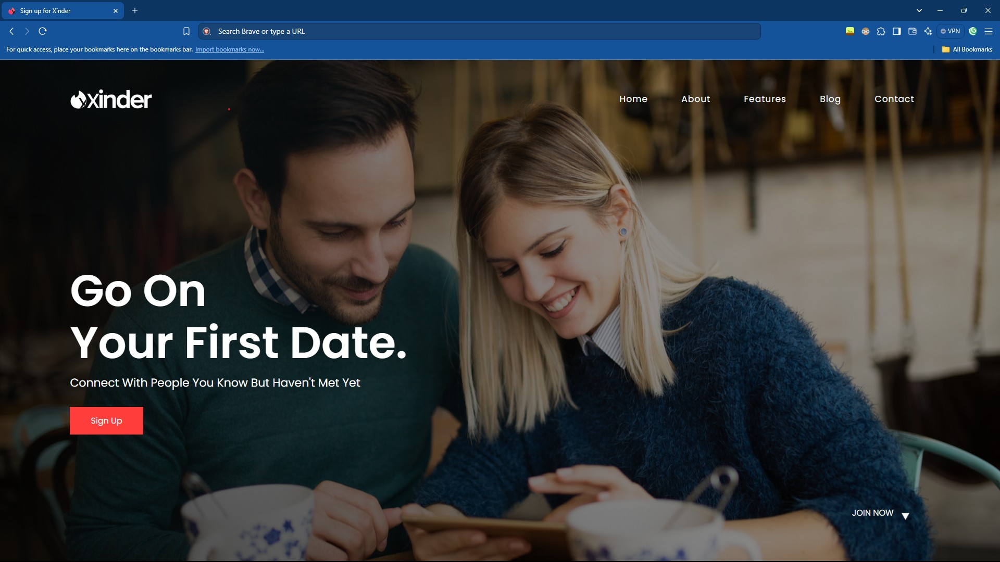
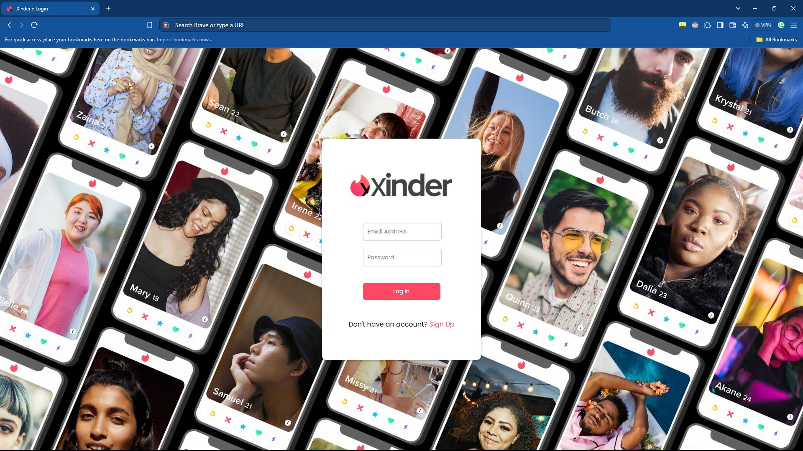
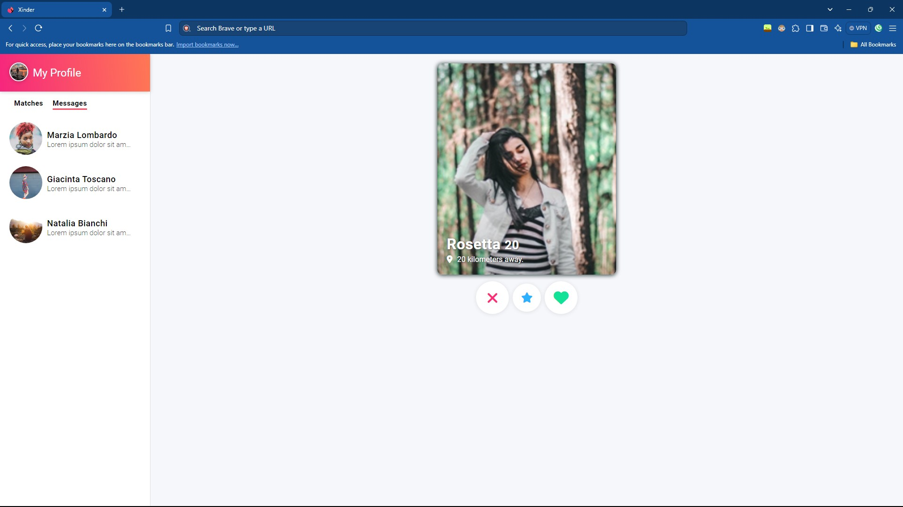

# Xinder

This is a fresh take on Tinder, in three parts, a landing page, a login page and the main website, in HTML, CSS & a little bit of FontAwsome.

The assets can be found: [here](https://github.com/reginaldop/tinder-html-css), [here](https://drive.google.com/file/d/12co21YLqM0LFhSH62U9_h1yEflGHB_nj/view) and [here](https://gemini.google.com/app) but I used my own.

**(Thanks ReCreating, GreatStack & Google Gemini!)**


## Acknowledgements

 - Tutorial(s) by: [ReCreating](https://www.youtube.com/@ReCreating), [GreatStack](https://www.youtube.com/@GreatStackDev) and [Google Gemini](https://gemini.google.com/app).

 - A huge shoutout to my youngest project as of writing this: [xFlix](https://github.com/l-xdt/xflix/).

 - A huge help in this project: [DiffChecker](https://diffchecker.com/).


## Authors

- [LeidenSchaft-Xiotim Development Team](https://www.github.com/l-xdt/)

- [Alvin Maranx, II ツ (Avun)](https://www.github.com/avunii/)

- [GreatStack](https://www.youtube.com/@GreatStackDev)

- [Google Gemini](https://gemini.google.com/app)

- [ReCreating](https://www.youtube.com/@ReCreating)


## Demo

There is a demo on this project! and I'm not being indirect, here is the link: click [here](https://l-xdt.github.io/xinder/).


## Features

- Uses FontAwsome for 3 icons.

- Mostly reliant on Images and can be used offline.

- You are in control of the project.

- There are many factores to change: like the color palette.

- **PS:** There is a lot in the little features, so I can't say a lot on it currently.


## Screenshots







**Written in plain HTML & CSS, and uses a little bit of font awsome. I don't know about the rest.**

## Run Locally

Clone the project and run it on XAMPP.

```bash
  git clone https://github.com/l-xdt/xinder/
```

Go to the project directory

```bash
  cd xinder
```

Install XAMPP (via Chocalatey, if you don't have it).

```bash
  chocalatey install xampp
```

Start the server

```bash
  [Directory]/[ServerName]/apache-start.bat
```

**PS:** If you trust your web skills, here is a manual on how to self-host a domain, [here](https://www.youtube.com/watch?v=_eQGAJVtRCs) (by Soeng Souy)


## Roadmap

- Change the Images.

- Change the HTML.

- Change the CSS.

- Change whatever you would like to make it your own.

- Change the icons.

- Change the code.

- Change the color pallette.

- Inspired by our signature: **X**, which you can change if you wanted.

- **PS:** You can get from the landing screen to the login by also clicking 'Join Now' with the arrow.


## Support

For support, shoot a message to either of our emails: [here](mailto:leidenschaft.tech@hotmail.com) or [here](mailto:trowesigames@gmail.com) or join our Discord Server: which is not up as of writing this.


## Feedback

This applies to feedback aswell, Whether you want to give us postive words of encouragement, or negative words, send away! (but please, only send constructive critisism).

Send away: [here](mailto:leidenschaft.tech@hotmail.com) or [here](mailto:trowesigames@gmail.com).

## FAQ

**Now for my favourite, FAQ!**

#### Can I modify this to fit my needs?

Yes, why of-course! That is why we make stuff like this and publish it onto the internet, for you to try, fail and correct your mistakes, using our code as a place of refrence.

#### Can I hot this, if I can, how?

Yes, you can! With my favourite Apache Container, XAMPP! Since I have explained it 22 times (I'm not counting), I'm not kiddding, but we can skip the explanation since you know the drill.

So! Here is a [download](https://www.apachefriends.org/download.html) to the server. XAMPP (of-course)! And if you are struggling about you can start hosting with this [tutorial](https://www.youtube.com/watch?v=LzucEZh4_no) (by MainlyWebStuff).

And if you truly trust your web skills, you can use this [tutorial](https://www.youtube.com/watch?v=_eQGAJVtRCs) (by Soeng Souy) to self-host a domain.

## Used By

This project is used by the following companies:

- LeidenSchaft-Xiotim Accqusitions (Limited).

- XDT-Studium.

- Xiotim Development Team [Limited] (XDT).

- XDT-noHesi.

## Related

- Here are some related projects:

- [Xinder - This Project](https://github.com/l-xdt/xinder/)

- [xFlix](https://github.com/l-xdt/xflix/)

- [LinkedX](https://github.com/l-xdt/linkedx/)

- [Main Website](https://github.com/l-xdt/l-xdt.github.io/)

- [FTP (x-FTP)](https://github.com/l-xdt/ftp/)

- [L-XDT](https://github.com/l-xdt/l-xdt/)

- [Documentation (x-Doc)](https://github.com/l-xdt/documentation/)

- [Phone (xPhone-UI)](https://github.com/l-xdt/phone/)

- [xLinks](https://github.com/l-xdt/xlinks/)

- [XInterest](https://github.com/l-xdt/xinterest/)

- [Xelegram](https://github.com/l-xdt/xelegram/)

- [XApp](https://github.com/l-xdt/xapp/)

- [XCord](https://github.com/l-xdt/xcord/)

- [XChat](https://github.com/l-xdt/xchat/)

- [XGram](https://github.com/l-xdt/xgram/)

- [xSocial](https://github.com/l-xdt/xSocial/)

- [Xirox](https://github.com/l-xdt/xirox/)

- [XioTube](https://github.com/l-xdt/xiotube/)

- [Studium](https://github.com/l-xdt/studium/)

- [XioTok](https://github.com/l-xdt/xiotok/)

- [XioTim](https://github.com/l-xdt/xiotim/)

- [no-Hesi](https://github.com/l-xdt/no-hesi/)

## Documentation

- I don't have any proper documentation, but I can give you the links to the tutorial(s):

- [ReCreating's Tutorial (on YouTube)](https://www.youtube.com/watch?v=xhEWK7kP1RU)

- [GreatStack's Tutorial (on YouTube)](https://www.youtube.com/watch?v=lm3-3_w7d-g)

- Oh, and last but not least, a link to: [Google Gemini](https://gemini.google.com/app).

## API Reference

There are no APIs, to be known of, used in this  project. This project only consists if Vanilla HTML & CSS, and slight traces of FontAwsome. If there are any APIs, I will personally update this ReadMe.
